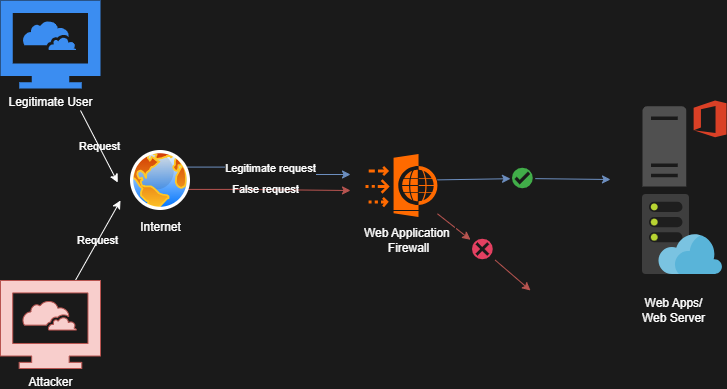

# SafeLine WAF HomeLab Project
by **Saugat Chaudhary**

---

## Overview

This repository documents the deployment and demonstration of a **Web Application Firewall (WAF)** using **SafeLine** to protect a deliberately vulnerable web application (DVWA) hosted on Ubuntu Server.  
The lab environment uses VMware, Ubuntu, and Kali Linux to simulate a realistic cybersecurity defense scenario.

---

## Architecture Diagram

---

## Tools and Components

| Component | Description |
|------------|-------------|
| **VirtualBox** | Virtualization platform used to create isolated VMs |
| **Ubuntu Server 22.04** | Hosts the LAMP stack and DVWA |
| **Kali Linux** | Acts as the attacker machine |
| **SafeLine WAF** | Web Application Firewall for application protection |
| **DVWA** | Damn Vulnerable Web Application (target) |
| **OpenSSL** | Used to generate self-signed SSL certificates |

---

## 1. Virtual Machine Setup

Screenshots illustrate the creation and network configuration of both virtual machines.

| Description | FilePath |
|--------------|-------------|
| VirtualBox VM list | 1_VirtualBox_Setup/virtualbox_vms_list.png |
| Ubuntu NAT network configuration | 1_VirtualBox_Setup/ubuntu_network_bridged.png |
| Kali NAT network configuration | 1_VirtualBox_Setup/kali_network_bridged.png |

---

## 2. Ubuntu Server and DVWA Configuration

DVWA was installed on a LAMP stack hosted on Ubuntu Server.  
These screenshots show the server running and DVWA accessible over HTTP.

| Description | FilePath |
|--------------|-------------|
| Apache running successfully | 2_Ubuntu_DVWA_Setup/apache_status.png |
| DVWA cloned and configured | 2_Ubuntu_DVWA_Setup/dvwa_clone.png |
| DVWA running on port 8080 | 2_Ubuntu_DVWA_Setup/dvwa_running_8080.png |

---

## 3. DNS and SSL Configuration

Local DNS resolution was configured for `dvwa.local` and a self-signed SSL certificate was created for secure HTTPS access.

| Description | FilePath |
|--------------|-------------|
| /etc/hosts entry for dvwa.local | 3_DNS_and_SSL/kali_hosts_dvwa.png |
| Successful ping to dvwa.local | 3_DNS_and_SSL/ping_dvwa_local.png |
| SSL certificate created using OpenSSL | 3_DNS_and_SSL/openssl_create_cert.png |

---

## 4. SafeLine WAF Deployment and Configuration

SafeLine WAF was installed and configured as a reverse proxy to protect DVWA.  
These screenshots show the WAF interface and application onboarding.

| Description | FilePath |
|--------------|-------------|
| SafeLine installation on Ubuntu | 4_SafeLine_Deployment/safeline_install_terminal.png |
| SafeLine login page | 4_SafeLine_Deployment/safeline_login.png |
| SafeLine dashboard overview | 4_SafeLine_Deployment/safeline_dashboard.png |
| SSL certificate imported into WAF | 4_SafeLine_Deployment/ssl_import.png |
| DVWA application onboarded | 4_SafeLine_Deployment/dvwa_onboarded.png |

---

## 5. Attack Demonstration and WAF Protection

Attacks such as SQL Injection and HTTP Flood were launched from Kali Linux to test SafeLine’s detection and blocking capabilities.

| Description | FilePath |
|--------------|-------------|
| SQL Injection attempt from DVWA | 5_Attack_and_Defense/sqli_payload_before.png |
| WAF blocked malicious SQL request | 5_Attack_and_Defense/sqli_blocked_page.png |
| SafeLine log showing SQLi detection | 5_Attack_and_Defense/sqli_waf_log.png |
| Custom deny rule applied to attacker IP | 5_Attack_and_Defense/deny_rule_create.png |
| IP blocked by WAF policy | 5_Attack_and_Defense/blocked_by_ip.png |

---

## 6. Before vs After WAF Comparison

| Without WAF | FilePath |
|--------------|------------------|
| 6_Comparison/dvwa_direct_before_waf.png | 6_Comparison/dvwa_via_waf_blocked.png |

---

## Learning Outcomes

- Gained hands-on experience deploying a Web Application Firewall.  
- Understood reverse proxy architecture and SSL integration.  
- Simulated real-world web attacks (SQLi, HTTP Flood).  
- Observed WAF logging and mitigation in action.  
- Built a reproducible homelab environment for cybersecurity demonstrations.

---

## Author

**Saugat Chaudhary**

---

## License

This project is licensed under the MIT License – see the LICENSE file for details.
